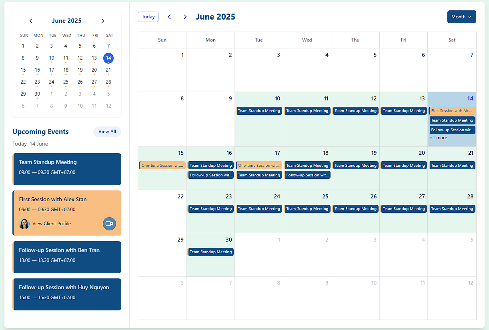

# Calendar Application

A modern, modular calendar application built with React, TypeScript, and Tailwind CSS. This project demonstrates scalable architecture using component-based design.

## 1. Proposed Data Structure (from `src/data/api.ts`)

The backend should return an array of event objects with the following structure:

```typescript
{
  id: string,
  title: string,
  description: string,
  startDate: string, // ISO8601 datetime
  endDate: string,   // ISO8601 datetime
  type: string,      // 'event' | 'appointment'
  recurrence: {
    frequency: string, // e.g., 'DAILY', 'WEEKLY'
    byDay?: string[]   // e.g., ['MO', 'WE', 'FR']
  } | null,
  client: {
    name: string,
    email: string,
    avatar: string,
    webURL: string
  } | null
}
```

**Why this structure?**

- Supports both one-time and recurring events.
- Recurrence is flexible and can be extended for more rules.
- Client info is included only when relevant (for appointments).
- Easy to map to UI and extend for future needs.

**Example:**

```typescript
{
  id: "event-001",
  title: "Team Standup Meeting",
  description: "Daily standup with engineering team",
  startDate: "2025-06-10T09:00:00",
  endDate: "2025-06-30T09:30:00",
  type: "event",
  recurrence: {
    frequency: "DAILY",
    byDay: ["MO", "TU", "WE", "TH", "FR", "SA"],
  },
  client: null,
}
```

## 2. Preview

The current implementation includes:

- Main and Mini Calendar components.
- Event cards and dialogs for event details.
- Modular structure for easy extension.

Below is a live preview of the Calendar Application:



### 2a. BONUS: Recurring Event Design

Store recurrence rules in iCal RRULE format (RFC 5545), and use a library like `rrule.js` on the frontend to expand occurrences.

## 3. Getting Started

### Prerequisites

- [Node.js](https://nodejs.org/) (v16 or higher recommended)
- [pnpm](https://pnpm.io/) (or use npm/yarn if preferred)

### Install dependencies

Using pnpm:

```bash
pnpm install
```

Or with npm:

```bash
npm install
```

### Start the development server

```bash
pnpm start
```

Or with npm:

```bash
npm run start
```

This will start the app in development mode and open it in your browser. The default port is usually 8080 or 3000 (see your terminal output).

### Build for production

```bash
pnpm build
```

Or with npm:

```bash
npm run build
```

The production-ready files will be output to the `dist/` directory.

## 4. What I Learned

- Explore the inner workings of modern calendar applications, including how they manage events, recurrence, and user interactions.
- Evaluate which calendar library best fits your project's needs by comparing options such as react-calendar, react-big-calendar, FullCalendar, and others.

## 5. Future Development

I am interested in continuing development. Next steps could include:

- Completing advanced recurring event logic and UI.
- Adding event reminders and notifications.
- Integrating with external calendar APIs (Google, Outlook).
- Improving accessibility and mobile responsiveness.
- Implementing user authentication and multi-user support.
- Notification when having conflict events
- Validate input create/update events
